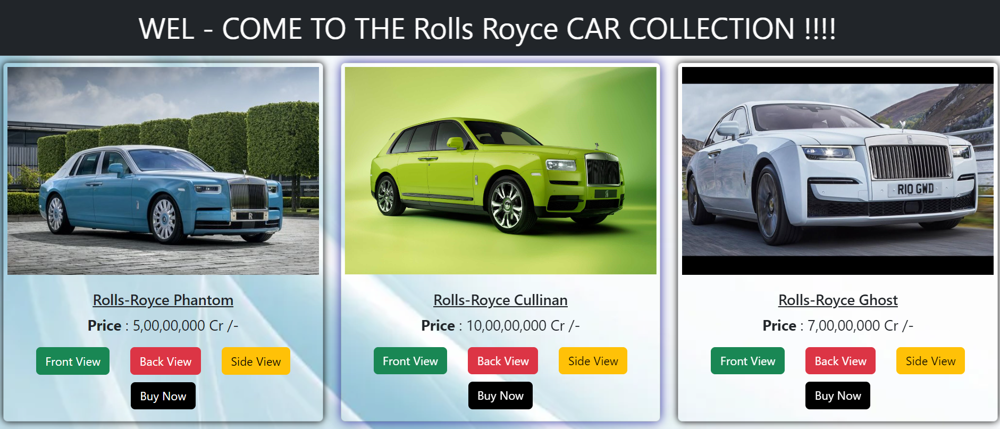

# Car_Collection 🚗

### Description:-

#### Curated Car Collections 🚔Browse Now!

Car-Collection is your online destination for exploring a curated selection of exquisite automobiles from classic to contemporary,
offering enthusiasts a virtual showroom of automotive excellence.
A car collection typically refers to a group of automobiles that have been accumulated and preserved over time by a passionate collector. These collections can range in size from a handful of cars to hundreds or even thousands of cars. Car collections often have a specific theme or focus, such as vintage cars, classic sports cars, muscle cars, luxury vehicles, or exotic supercars. The automobiles in a car collection are often meticulously maintained and cared for, and may be restored or modified to enhance their original features or performance. Many car collectors view their collections as works of art or as an investment that will appreciate in value over time. Car collections can be displayed in private garages, museums, or at special events, and are often a source of pride and admiration for their owners.

# Our Project Images

 

# Most Searched Car

# Price Collection

### Our Team

## Summarize
Car Collection is an online marketplace for buying and selling high-end luxury vehicles. The website features an extensive inventory of exclusive and rare automobiles from around the world. Each vehicle listing includes detailed information, high-quality images and a verified history report. Car Collection offers a personalized buying experience with a team of expert advisors available to assist with financing, shipping and any other needs you may have. Whether you are a collector or simply looking for a rare and exceptional automobile, Car Collection is the ultimate destination for luxury car enthusiasts.

# Contribute:-

